# Issue #75 — Macros compile-time avec vraies résolutions

## 1. Contexte

Le système de macros actuel est un moteur de **templates textuels** : `MacroDef.BodyText` est une
tranche de source brute (`ParseDecl.cpp:600-637`), scannée à l'ordre 15 pour y trouver des balises
`` / `` / `{{ }}`, réémise en texte, puis re-lexée / re-parsée
(`ConstEval/Private/MacroExpansion.cpp`).

Il ne résout rien. Preuve, aujourd'hui, sur les deux seuls samples du dépôt :

```
$ ./volt check -i samples/Syntax/Macros/Serializable.vl   →  34 erreurs
$ ./volt check -i samples/Syntax/Macros/Delegate.vl       →   1 erreur
```

Trois défauts structurels, tous vérifiés dans le code :

1. **Les méthodes générées n'existent pour personne.** `DeclareMembers` (phase A de `BindUnitTypes`)
   fige la liste des membres de chaque type **au seam sérial**, avant toute passe. Une `Method`
   ajoutée à l'ordre 15 n'est donc jamais un `Member` du `TypeStore` — or `LookupMemberOn`
   (résolution) et `DeclareSweep.cpp` (émission LLVM) **itèrent le store, pas les AST**. La méthode
   générée n'est ni appelable, ni émise. C'est le sens de « REAL RESOLUTIONS » dans le titre du
   ticket, et c'est le commentaire du Driver lui-même (`Driver.cpp:345-348`) : *« a Method a Sema
   pass adds later would never be found by name »*.
2. **Le moteur laisse des déchets dans l'arène.** `EvalText` lexe/parse chaque balise dans le même
   `AstContext` ; ces nœuds ne sont ni abaissés ni typés, et `AstInvariant` les signale
   (`residual sugar node 'ArrayLit' survived lowering`, `… never given a type`). `CheckSugar` ne
   consulte pas le masque `MetadataExprs` que `CheckTyped` respecte déjà.
3. **La syntaxe est un DSL parallèle** (`` / `{{ }}`) que l'issue #75 veut supprimer.

Le ticket #75 remplace tout cela par : `macro def` (une méthode dont le corps est un programme
compile-time), `macro do` (bloc top-level d'effets de bord), les backticks `` `cmd` `` (exécution
shell hôte), et l'introspection `self.fields` — le tout en **vrai code Volt**, sans balises.

### Décisions produit déjà tranchées

| Sujet | Décision |
|---|---|
| DSL `` / `{{ }}` | **Supprimé intégralement**, ainsi que la forme « macro invocable » (`serializable( … )` en corps de classe) et le nœud `MacroInvoke`. |
| Sémantique du corps | **Comptime-Driven Staging** (§3) : le staging est piloté par le flux de données depuis des *sources compile-time*. Aucun mot-clé ajouté (`quote`, `comptime`, `macro if` : refusés). |
| Constantes globales `BUILD_COMMIT : String = …` | **Dans ce ticket** : parse d'un nom majuscule en position de déclaration top-level. |
| Exécution shell | **Autorisée partout**, y compris `source/Lib`, avec timeout + plafond de sortie + `exit ≠ 0` = erreur de compilation. Conséquence assumée : dans la stdlib la sortie est figée dans le cache disque jusqu'à invalidation. |

---

## 2. Le mur d'ordonnancement, et sa levée

`macro def to_json` vit dans `mixin Serializable` ; ses `self.fields` sont ceux de `class User`, qui
peut être dans **une autre unité**. La méthode générée doit être un membre de `User`.

- Les passes (ordre 8→40) sont **par unité, parallèles**, et reçoivent `const TypeStore &`
  (`Pass.hpp:102`). Elles ne peuvent ni écrire dans le store, ni muter l'AST d'une autre unité.
- Le **seam sérial** (`Driver.cpp:490-565`) a exactement les deux droits nécessaires : `TypeStore &`
  mutable et un `std::vector<Frontend::AstContext *>` mutable.
- Le précédent exact existe déjà : **`SynthesizeFinalizeStubs`** (`TypeBinder.cpp:1412-1622`) crée
  une `Frontend::Method`, la greffe dans le `Body` du type (copy-out / write-back) et l'enregistre
  via `Store.AddMember` — après quoi la boucle `ResolveUnitSignatures` existante lui résout sa
  signature sans une ligne de plus.

**Décision : l'expansion des `macro def` devient une étape de seam**, `ExpandTypeMacros`, placée
entre `SynthesizeFinalizeStubs` et la boucle `ResolveUnitSignatures`. Les `macro do` y sont exécutés
aussi (ordre fichier ⇒ sortie `puts` déterministe, ce que la phase parallèle ne peut pas garantir).
Le repli des backticks en dehors des macros reste une passe par unité à l'ordre 15 (balayage O(N),
parallèle, aucune écriture partagée).

Deux conséquences imposées par cette position (vérifiées, et contraires à une intuition courante) :

- `NominalType::Includes` / `Super` sont remplis par la **phase signatures**, donc *après* nous : les
  `include` se lisent sur l'AST, exactement comme le fait `ParentNominals` (`TypeBinder.cpp:1373`).
- `Member::Result` d'un champ n'est pas encore résolu : `field.type` est donc **la graphie écrite**,
  lue sur `Frontend::Field.DeclType`. C'est ce qu'il faut pour la génération de code, et c'est
  zéro-hardcode (on rend la graphie de l'utilisateur, on n'en interprète aucune).

```mermaid
flowchart TB
    subgraph AV["AVANT — cassé"]
        A1["parse (∥)"] --> A2["seam sérial<br/>BindUnitTypes → DeclareMembers<br/><b>le store gèle ici</b>"]
        A2 --> A3["sema.lowering (∥)<br/>MacroExpansion (15)<br/>texte → re-parse → Method"]
        A3 --> A4["TypeChecker (30)<br/>LookupMemberOn ← store"]
        A4 --> A5["DeclareSweep ← store"]
        A3 -. "Method absente du store" .-> A6(["jamais résolue<br/>jamais émise"])
    end
    subgraph AP["APRÈS"]
        B1["parse (∥)<br/>macro def → StmtList réelle"] --> B2["seam sérial<br/>BindUnitTypes<br/>ResolveStructLayouts<br/>SynthesizeFinalizeStubs"]
        B2 --> B3["<b>ExpandTypeMacros</b> (nouveau, sérial)<br/>évalue les macro def par type cible<br/>greffe la Method + Store.AddMember<br/>exécute les macro do (ordre fichier)"]
        B3 --> B4["ResolveUnitSignatures<br/>résout la signature générée"]
        B4 --> B5["ComputeAllVTableSlots<br/>slot vtable acquis"]
        B5 --> B6["sema.lowering (∥)<br/>MacroExpansion (15)<br/>replie ` cmd ` hors macro"]
        B6 --> B7["TypeChecker (30) ✓"] --> B8["DeclareSweep ✓"]
    end
```



---

## 3. Sémantique normative — Comptime-Driven Staging

Le corps d'un `macro def` est un **programme compile-time qui produit le corps d'une méthode**. Le
staging est décidé par le flux de données, pas par une syntaxe.

**R1 — Sources compile-time (la liste est close).**
Introspection du type cible (`self`, `self.fields`, `self.name`), littéraux de commande
`` `cmd` ``, constantes magiques (`__DIR__`, `__FILE__`, `__LINE__`… lues depuis
`MagicConstants.inl`), et les paramètres du bloc d'une boucle compile-time.

**R2 — Propagation.** Une liaison locale est *comptime* si son initialiseur contient une source
comptime ; une expression est comptime si tous ses opérandes le sont et que ses opérations sont dans
`MacroOps.inl`. Un littéral est une *valeur* comptime mais **pas** une source : `json = "{"` reste
donc une variable runtime, conformément à la spécification retenue.

**R3 — Runtime.** `@ivar`, `self` en position de valeur, les paramètres de la méthode générée, et
tout appel dont le récepteur ou le callee est runtime.

**R4 — Contrôle de flux.** `if` / `case` dont la condition est comptime : seule la branche gagnante
est visitée, le `if` n'est pas émis. Boucle sur un itérable comptime : déroulée, le corps est visité
une fois par élément. Si la condition/l'itérable est runtime, la construction est **émise telle
quelle** (une boucle runtime ordinaire reste légale dans une méthode générée).
*Détail d'implémentation non négociable :* **il n'existe aucun nœud `For`** — `for x in seq` est
désucré au parse en `seq.each { |x| … }` (`ParseStmt.cpp:269-311`), soit
`Call{ Callee: Member(seq,"each"), BlockArg: Block{ Params:[x], Body } }`. Le dépliage se reconnaît
donc sur cette forme, pas sur un `Frontend::For`.

**R5 — Émission.** Toute instruction non entièrement comptime est **clonée** dans l'arène du type
cible via `Frontend::CloneStmt` (`AST/AstClone.hpp` — déjà existant, cross-`AstContext`, ré-interne
les symboles), puis le clone est parcouru et *splicé* :
- `IvarInterp` (`@#{expr}`) → `InstanceVar{ Name = Intern("@" + valeur) }` (le `@` fait partie du
  lexème interné, cf. `MemberResolver.cpp:78`) ;
- `Identifier` lié à une valeur comptime → nœud littéral correspondant ;
- `Interp` dont toutes les parts sont comptime → `StringLiteral` ;
- `CommandLit` → `StringLiteral` (la commande est exécutée) ;
- tout le reste → inchangé.
C'est ce qui produit `assert!( 1024 > 0 )` dans l'exemple §2 de l'issue : appel runtime, arguments
repliés.

**R6 — Opérations du compilateur.** `MacroOps.inl` est le manifeste **clos** des opérations
compile-time (`size`, `lines`, `trim`, `chomp`, `basename`, `name`, `type`, `each`, `puts`). Un appel
dont le callee est une de ces graphies **et** dont tous les arguments sont comptime s'exécute à la
compilation et n'émet rien ; c'est ce qui distingue `puts "…"` (console du compilateur) de
`assert!( … )` (émis). Tout le reste est émis.

**R7 — Hygiène.** Toute liaison synthétisée par le moteur passe par `AstContext::MakeUniqueSymbol`
avec un préfixe contenant un caractère que le lexeur d'identifiants ne peut pas produire, donc
inatteignable depuis le code utilisateur.

**R8 — Bornes.** Profondeur de récursion d'expansion plafonnée (constante voisine de
`MaxFinalizeDepth`), nombre de commandes shell par unité plafonné, aucune boucle combinatoire :
l'expansion est linéaire en (types × macros × champs).

### Les quatre exemples de l'issue, résolus

| Exemple | Comptime | Émis |
|---|---|---|
| `to_json` | `self.fields`, dépliage de la boucle, `#{field.name}`, `@#{field.name}` (nom) | `json = "{"`, un `json += …` par champ, `json.chomp(",") + "}"` |
| `register_test_suite` | tout (`` `find` ``, `.lines`, `.basename`, `puts`, la boucle) | `assert!( 1024 > 0 )` par itération — arguments repliés |
| `system_exit` | `` `uname`.trim == "Linux" ``, sélection de branche | `libc_linux_exit( code )` seul (`code` = paramètre runtime) |
| `macro do` | tout | rien — 0 octet |

---

## 4. Découpage en tâches

Chaque tâche laisse l'arbre compilable et testable. **T1→T2 sont additives** (aucune suppression) ;
la bascule du legacy n'arrive qu'en T4.

### T1 — Lexer & parser (surface syntaxique)

*Fichiers* : `Lexer/TokenKind.inl`, `Private/Lexer/Lexer.cpp`, `AST/Nodes.inl`, `AST/Expr.hpp`,
`AST/Decl.hpp`, `Private/Parser/ParseExpr.cpp`, `ParseDecl.cpp`, `ParseStmt.cpp`, `Parser.hpp`.

1. **Tokens** — deux lignes dans `TokenKind.inl` :
   ```cpp
   VOLT_TOKEN( CommandLiteral ) // `cmd` — commande hôte, exécutée à la compilation
   VOLT_TOKEN( IvarInterp )     // @#{expr} — ivar au nom calculé
   ```
   *Réponse à la question « `CommandLiteralBegin/Mid/End` ? » : non.* Volt lexe une chaîne
   interpolée en **un seul token** portant `bHasInterpolation`, et le parser re-scanne le lexème pour
   fabriquer `Interp` (`ParseExpr.cpp:1035-1101`). Les backticks doivent suivre exactement ce
   modèle : `LexCommand` est un clone de `LexString` (délimiteur `` ` ``, même gestion de `\` et de
   `#{…}` à profondeur d'accolades). Trois tokens casseraient la symétrie sans rien apporter.
2. **`@#{`** — aujourd'hui `@` non suivi d'un identifiant tombe dans `LexPunct` puis `#` **ouvre un
   commentaire** (`Lexer.cpp:519`) : `@#{x}` mange la fin de ligne. Ajouter le cas dans `Next()`,
   juste avant celui de `@name` : `'@'` + `'#'` + `'{'` → capture jusqu'à l'accolade appariée,
   lexème = le texte intérieur.
3. **Nœuds** (`Nodes.inl` + agrégats simples — pas de `VOLT_FIELDS` : la réflexion est P2996, le
   skill `add-ast-node` est ici périmé) :
   ```cpp
   VOLT_EXPR_SUGAR( CommandLit )   // doit disparaître avant TypeChecker
   VOLT_EXPR_SUGAR( IvarInterp )
   VOLT_DECL( MacroBlock )

   struct CommandLit { Core::SourceRange Loc; ExprList Parts; };  // segments, comme Interp
   struct IvarInterp { Core::SourceRange Loc; ExprId Name; };
   struct MacroBlock { Core::SourceRange Loc; StmtList Body; };
   ```
4. **`MacroDef` change de nature** — le corps devient du vrai AST :
   ```cpp
   struct MacroDef
   {
       Core::SourceRange Loc;
       Symbol      Name;
       ParamList   Params;      // les paramètres RUNTIME de la méthode générée
       TypeId      ReturnType;  // `-> String`, `-> self`
       StmtList    Body;        // vrai Volt parsé (remplace Symbol BodyText)
       bool        bSelf = false;
       EVisibility Visibility = EVisibility::None;
   };
   ```
   `ParseMacro()` dispatche sur le token suivant `macro` : `KwDef` → `ParseMacroDef()` (calqué sur
   `ParseMethod`, `ParseDecl.cpp:468` : `self.`, nom, params, `-> Type`, `ParseStatementBlock`,
   `end`), `KwDo` → `ParseMacroBlock()`.
5. **Parseurs d'expression** : `case TokenKind::CommandLiteral` → `ParseCommandLiteral( Tok )`
   (clone de `ParseStringLiteral`, réutilise `ParseSubExpression` pour les trous) ;
   `case TokenKind::IvarInterp` → `IvarInterp{ .Name = ParseSubExpression( … ) }`.
6. **Constante globale majuscule** : dans `ParseExprOrLocalStatement` (`ParseStmt.cpp:69`), accepter
   `Constant` en plus d'`Identifier` devant `:` → `LocalDecl`. Rien d'autre à faire en aval :
   `ScopeResolver` déclare les `TopStmts` dans le scope racine *avant* les `def`
   (`ScopeResolver.cpp:49-58`, « les locaux top-level sont les globaux »), et `ExprInferencer`
   consulte `FindLocal` **avant** `LookupType` (`ExprInferencer.cpp:678`) — un `BUILD_COMMIT` lié
   gagne donc contre l'interprétation « nom de type ».

*Blast radius* : goldens de `samples/Syntax/Macros/*` (le dump de `MacroDef` change). *Risques* :
faible ; le seul piège est l'ordre des cas dans `Next()` (`@#{` avant le commentaire `#`).

### T2 — `ProcessRunner` + repli des backticks + globales

*Fichiers* : `Core/Public/Volt/Core/Support/ProcessRunner.hpp`,
`Core/Private/Support/ProcessRunner.cpp` (le meson de Core globe `Private/**/*.cpp` : aucune édition),
`ConstEval/Private/MacroExpansion.cpp`, `ConstEval/.../MacroOps.inl`.

```cpp
// Core/Support/ProcessRunner.hpp
namespace Volt::Core
{
    struct ProcessLimits { std::uint32_t TimeoutMs = 10'000; std::size_t MaxBytes = 1u << 20; };

    struct ProcessResult
    {
        int ExitCode      = -1;
        std::string Out;                 // stdout capturé, tronqué à MaxBytes
        std::string Err;                 // stderr capturé, pour le diagnostic
        bool bTimedOut    = false;
        bool bTruncated   = false;
        bool bSpawnFailed = false;
    };

    [[nodiscard]] CORE_EXPORT ProcessResult
    RunShell ( std::string_view Command, std::string_view WorkDir, ProcessLimits Limits = {} );
}
```

POSIX : deux `pipe(2)`, `fork()`, `chdir( WorkDir )` + `dup2` + `execl( "/bin/sh", "sh", "-c", … )`
côté enfant ; `poll()` avec échéance côté parent, lecture plafonnée, `waitpid`, `SIGKILL` au timeout.
Windows : même interface, `CreateProcess` + pipes anonymes ; si l'implémentation Windows n'est pas
faite dans ce ticket, renvoyer `bSpawnFailed` avec un diagnostic explicite (jamais un silence).
`CORE_EXPORT` obligatoire : symbole traversant les modules en build `.so`.

`WorkDir` = répertoire du fichier compilé, cohérent avec `__DIR__`.

Repli, dans la passe d'ordre 15 (balayage de l'arène `Expr` **par index croissant** : les
sous-expressions ont un index plus petit, donc les chaînes `` `cmd`.trim `` se replient de
l'intérieur vers l'extérieur en une seule passe ; copy-out / write-back par
`rules/ast-rewrite.md`) :
`CommandLit` → `StringLiteral` ; `Call( Member( <const>, op ), args )` → littéral quand `op` est dans
`MacroOps.inl`. `.lines` produit un `ArrayLit` de `StringLiteral` : **aucun code de typage nouveau**,
`LowerArrayLit` (`Lowering/LiteralLowering.cpp`, appelé depuis TypeChecker) et le binding
`@[Literal( StringLiteral )]` font le reste.

Diagnostics : `exit ≠ 0` → erreur portant les premières lignes de `stderr` ; timeout ; troncature ;
échec de `fork/exec`.

*Livrable démontrable* : `build_commit : String = ` `` `git rev-parse --short HEAD`.trim `` compile,
s'exécute, et affiche le vrai SHA. *Risques* : hermétisme du build (assumé, cf. §7).

### T3 — Moteur d'évaluation compile-time + introspection

*Fichiers* : `ConstEval/Private/MacroEval.{hpp,cpp}` (nouveaux, à ajouter à la liste de
`ConstEval/meson.build`), `MacroOps.inl`.

```cpp
struct MacroValue
{
    struct FieldDesc { std::string Name; std::string Type; };   // graphie écrite
    struct TypeDesc  { TypeSystem::NominalId Id; };
    std::variant<std::monostate, bool, std::int64_t, std::string,
                 std::vector<MacroValue>, FieldDesc, TypeDesc> Data;
};

struct MacroEnv
{
    const Frontend::AstContext &Source;   // là où vit le corps de macro
    Frontend::AstContext &Target;         // là où les nœuds émis sont construits
    const TypeSystem::TypeStore &Store;
    TypeSystem::NominalId SelfType;       // invalide dans un `macro do`
    ConstEval::MagicSite Site;            // __DIR__ & co, lus du même manifeste
    Volt::Core::DiagEngine::Bag &Diags;
    std::unordered_map<std::string, MacroValue> Comptime;
    std::uint32_t Depth = 0;
};

// Exécute les constructions comptime, empile dans Out les instructions émises.
void EvalBlock ( MacroEnv &Env, const Frontend::StmtList &Body, Frontend::StmtList &Out );
```

- `self` → `TypeDesc{ SelfType }` ; `self.fields` → `vector<FieldDesc>` construit depuis
  `Store.Type( Id ).Members` filtrés sur `EMemberKind::Field` (ordre de déclaration), le `Type`
  venant de `Frontend::Field.DeclType` via `Member::Decl`. Zéro nom Volt en dur.
- `if` / `case` comptime : descente dans la seule branche gagnante.
- Dépliage : `Call( Member( recv, "each" ), BlockArg = Block )` avec `recv` comptime → liaison des
  `Block.Params` puis `EvalBlock` du corps, une fois par élément.
- Émission : `CloneStmt` + splice (R5), en respectant strictement `rules/ast-rewrite.md` (jamais de
  référence d'arène conservée à travers un `Add()`).
- `__DIR__` & co : `ConstEval::ExpandMagic` (`MagicConstants.hpp`) — un manifeste, deux
  consommateurs, la passe 16 et le moteur.
- **Aucun nœud parasite** : le moteur ne lexe ni ne parse plus rien (le legacy `EvalText` disparaît),
  donc plus de déchets dans l'arène.

*Livrable démontrable* : `macro do` fonctionne de bout en bout (shell, boucles comptime, `puts` sur
la console du compilateur, diagnostics) — **sans toucher au store**, donc sans dépendre de T4.

### T4 — Étape de seam `ExpandTypeMacros` + enregistrement + retrait du legacy

*Fichiers* : `ConstEval/Public/…/MacroEngine.hpp` (nouveau), `ConstEval/Private/MacroEngine.cpp`
(nouveau), `Driver/Private/Driver.cpp`, `ConstEval/Private/MacroExpansion.cpp` (réduit au repli des
backticks), `Analysis/Private/{LiteralInferencer,AstInvariant}.cpp`,
`Resolver/Private/ScopeResolver.cpp`, `Frontend/Private/Parser/ParseDecl.cpp`.

```cpp
// ConstEval/Public/Volt/MiddleEnd/ConstEval/MacroEngine.hpp
namespace Volt::MiddleEnd::ConstEval
{
    // Étape de seam sérial : évalue chaque `macro def` une fois par type cible
    // concret, greffe la Method générée dans le Body de ce type et l'enregistre
    // comme Member — la boucle ResolveUnitSignatures qui suit lui résout sa
    // signature comme à une méthode écrite à la main. Exécute aussi les
    // `macro do`, en ordre de fichier. Une entrée nulle = unité stdlib servie
    // par le cache : déjà expansée, ignorée (même convention que
    // SynthesizeFinalizeStubs).
    VOLT_MIDDLEEND_CONSTEVAL_EXPORT void
    ExpandTypeMacros ( std::span<Frontend::AstContext *const> Units,
                       TypeSystem::TypeStore &Store,
                       const Volt::Core::SourceManager &Sources,
                       Volt::Core::DiagEngine::Bag &Diags );
}
```

Appel dans `Driver.cpp`, juste après `SynthesizeFinalizeStubs( MutableUnitAsts, Types )` et **avant**
la boucle `ResolveUnitSignatures`. `ConstEval` dépend déjà de `TypeSystem` (arête avant documentée
dans son `meson.build`) et le Driver lie l'agrégat `volt_middleend_dep` : aucune modification de
graphe de dépendances.

Algorithme, par type `T` de `Store` (`TypeCount()`), en ignorant mixins et types génériques non
instanciés pour la génération :
1. Collecter les `MacroDef` : celles du `Body` de `T`, puis celles de chaque mixin `include`, lu
   **sur l'AST** (`Includes` du store n'est pas encore rempli) — même forme que `ParentNominals`.
2. Pour chacune : `MacroEnv{ Source = AST du mixin, Target = AST de T, SelfType = T }`, `EvalBlock`.
3. Construire la `Frontend::Method` (nom, `Params` clonés, `ReturnType` cloné, `Body` = instructions
   émises), `Ast.Add`, greffe dans le `Body` de `T` par copy-out / write-back.
4. `Store.AddMember( T, Member{ .Name = Store.Intern( … ), .Kind = EMemberKind::Method,
   .Unit = <unité de T>, .Decl = <DeclId greffé>, .Visibility = … } )`.
5. Une macro qui redéfinit un membre existant de `T` → diagnostic (pas d'écrasement silencieux).

Puis, dans la même étape : exécution des `MacroBlock` de chaque unité, en ordre de fichier.

Retraits du legacy, dans la même tâche :
- `VOLT_DECL( MacroInvoke )`, `struct MacroInvoke`, `Parser::ParseMacroInvoke`, la règle
  « `identifiant(` en position de déclaration » (`ParseDecl.cpp:247` revient à `ParseFieldOrMember`),
  l'arme `MacroInvoke` de `LiteralInferencer.cpp:57`, et tout le scanner de templates de
  `MacroExpansion.cpp` (≈ 400 lignes).
- `MetadataExprs` marque désormais les expressions atteignables depuis un `MacroDef`/`MacroBlock`
  (les nœuds restent dans l'arène : elle est append-only), et **`AstInvariant::CheckSugar` consulte
  ce masque** comme `CheckTyped` le fait déjà — c'est la correction du bug n°2 du §1.
- `ExpandTypeMacros` retire les `MacroDef`/`MacroBlock` des `Body` et de `TopDecls` après
  consommation ; `ScopeResolver` et `TypeChecker` ne les voient donc jamais.

*Risques* : c'est la tâche sensible. Écriture dans le store au seam (sérial : pas de course), ordre
de greffe stable (déterminisme des goldens), et discipline d'arène stricte — `Store.AddMember` et
`Ast.Add` peuvent réallouer, donc toute valeur lue avant est **copiée**, jamais référencée.

### T5 — Samples, tests, cache, docs

- `FrontendCacheMagic` : `"VOLTFE13"` → `"VOLTFE14"` (`Driver.cpp:227`), avec le paragraphe de
  justification que le fichier exige : `MacroDef` change de forme sérialisée **et** les AST/stores
  stdlib mis en cache contiennent désormais des méthodes issues d'expansion.
- Réécriture de `samples/Syntax/Macros/Serializable.vl` (le `mixin Serializable` de l'issue) et de
  `Delegate.vl` (délégation par introspection, nouveau style) ; regénération des goldens.
- Nouveaux samples exécutables `samples/Tests/Macros/*.vl` + `.expected` (`exit=N`).
- `docs/` : la page de langage sur les macros (règles R1–R8, manifeste `MacroOps`, politique shell).

---

## 5. Tests & guardrails

**Fixtures parse (goldens, suite `golden`)** — `samples/Syntax/Macros/` :

| Fichier | Couvre |
|---|---|
| `Serializable.vl` | `macro def` en mixin, `self.fields`, `@#{…}`, dépliage |
| `Delegate.vl` | génération par introspection, nouveau style |
| `Commands.vl` | backticks avec et sans `#{}`, `.lines` / `.trim`, globale majuscule |
| `MacroDo.vl` | `macro do`, `__DIR__`, `puts` compile-time |
| `Conditional.vl` | `if` comptime (branche unique émise) |

**Fixtures exécutables (suite `samples`)** — `samples/Tests/Macros/` + `.expected` :
`ToJson.vl` (construit un `User`, appelle `user.to_json`, compare, `exit=0`) — c'est **le** test qui
prouve la vraie résolution : il échoue aujourd'hui à la fois à la résolution et à l'émission.
`BuildInfo.vl` (constante globale alimentée par un backtick, imprimée).

**Diagnostics à couvrir** (fixtures d'erreur) : commande inexistante (`exit ≠ 0`), timeout, sortie
tronquée, `macro def` redéfinissant un membre existant, `@#{…}` hors corps de macro, profondeur
d'expansion dépassée.

**Guardrails**
- `AstInvariant` : `CommandLit` et `IvarInterp` sont `VOLT_EXPR_SUGAR` — les oublier devient une
  erreur de build, pas une découverte tardive.
- Zéro-hardcode : le grep de `rules/zero-hardcode.md` doit rester vide ; aucun nom de type Volt
  n'entre dans le C++. Les graphies de `MacroOps.inl` sont le vocabulaire du DSL macro, précédent
  déjà écrit dans l'en-tête du manifeste (`size`) — **à re-valider en revue** (§7).
- `-Werror` propre, `meson test` vert, `ninja -C build golden-update` sans diff parasite.
- TSAN (Driver touché) : `volt check samples/Circuits/DiamandDeps`, zéro rapport.
- `graphify update .` en fin d'épic.

---

## 6. Vérification de bout en bout

```sh
# 1. le sample cassé aujourd'hui doit passer à zéro erreur
./volt check -i samples/Syntax/Macros/Serializable.vl     # 34 erreurs  →  0

# 2. la vraie résolution : appeler la méthode générée depuis une autre unité
./volt build -i samples/Tests/Macros/ToJson.vl -o /tmp/tojson && /tmp/tojson
# attendu : {"name":"Ada","age":36}

# 3. exécution shell + constante globale
./volt build -i samples/Tests/Macros/BuildInfo.vl -o /tmp/buildinfo && /tmp/buildinfo
git rev-parse --short HEAD    # doit correspondre

# 4. suite complète + goldens
meson test -C build --print-errorlogs
ninja -C build golden-update && git diff --stat tests/golden

# 5. cache : deux builds successifs, second en cache chaud, même résultat
./volt check -i samples/Tests/Macros/ToJson.vl && ./volt check -i samples/Tests/Macros/ToJson.vl
```

---

## 7. Arbitrages restants (à valider en revue)

1. **`MacroOps.inl` et la règle « aucun nom Volt dans le compilateur ».** `trim`, `lines`, `chomp`,
   `basename`, `puts` sont aussi des graphies de la stdlib. Le manifeste existant se déclare
   explicitement « part of the macro template DSL, not Volt type names », ce qui autorise la
   manœuvre, mais la liste doit rester **close et documentée**. Alternative si tu la refuses :
   réduire le vocabulaire comptime à `lines` / `size` / `name` / `type` et faire porter le reste par
   l'interpolation.
2. **`self.fields` : héritage ?** Recommandation v1 : champs **propres** au type, dans l'ordre de
   déclaration (les champs de la superclasse ne sont pas dans `Members` de la sous-classe). À
   étendre en v2 si un cas réel l'exige.
3. **Types génériques.** v1 : `macro def` sur un type générique est refusé par diagnostic (les
   graphies de champs contiennent des paramètres non résolus). L'ouvrir demanderait une expansion à
   l'instanciation, hors périmètre.
4. **Hermétisme du build.** Décision actée : shell autorisé partout. Dans `source/Lib`, la sortie est
   figée dans le cache disque jusqu'à modification d'une source stdlib (la clé hache les sources, pas
   la sortie des commandes). À documenter noir sur blanc dans la page macros.
5. **Windows.** `RunShell` est spécifié multi-plateforme ; si le backend Win32 n'est pas écrit dans
   ce ticket, il doit échouer par diagnostic explicite, jamais silencieusement.
