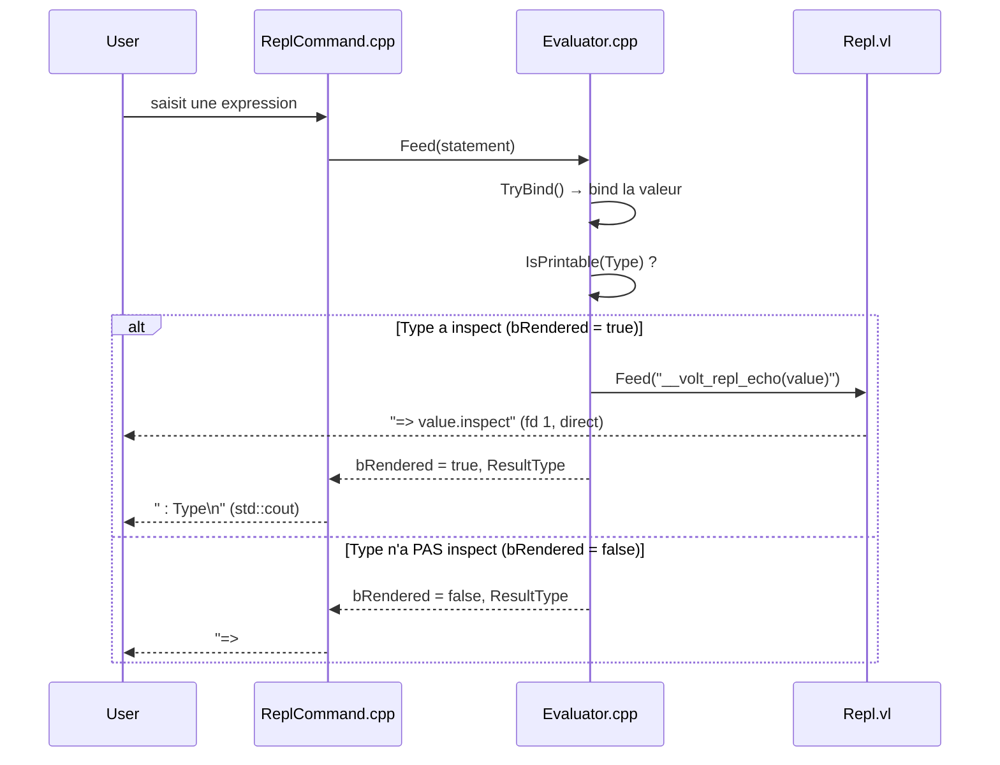

# Plan : Colored REPL Echo Output

## Objectif

Colorer la ligne de retour du REPL (`=> value : Type`) comme IRB colore `=> nil`.

**Avant :**
```
volt> puts "Hello World!"
Hello World!
=> #<StandardStream @fd=1> : StandardStream
```

**Après :**
```
volt> puts "Hello World!"
Hello World!
=> #<StandardStream @fd=1> : StandardStream   ← bold + dim, coloré
```

---

## Architecture actuelle

L'output est **découpé entre Volt et C++** :



### Fichiers impliqués

| Fichier | Rôle |
|---|---|
| [Repl.vl](file:///home/Yutsuna/Volt/source/Volt/REPL/Prelude/Repl.vl) | `__volt_repl_echo<T>` — imprime `=> value.inspect` |
| [ReplCommand.cpp](file:///home/Yutsuna/Volt/source/Volt/Volt/Private/Volt/CLI/Commands/ReplCommand.cpp#L127-L151) | Ajoute ` : Type` (printable) ou `=> #<Type> : Type` (non-printable) |
| [Evaluator.cpp](file:///home/Yutsuna/Volt/source/Volt/REPL/ReplEval/Private/Evaluator.cpp#L292-L310) | `IsPrintable()` — check si le type a `inspect` ; `DescribeType()` — stringify le type |

### Le problème du ` : Type`

Le nom du type en string vient de `DescribeType()` qui interroge le `TypeStore` côté C++. Volt n'a **pas** d'intrinsic pour stringify un type dans un générique :

- `self.name` → **macro-only** (dans `macro def` d'un mixin/classe), pas dans une fonction générique standalone
- `typeof(expr)` → yield un **type**, pas un string
- Pas de `name_of(T)` ni `T.name` aujourd'hui

---

## Choix de design : Volt est typé → on garde ` : Type`

---

## Piste A — `macro def __type_name` dans chaque mixin

Ajouter un `macro def __type_name -> String` partout où `inspect` est défini.

### Dans `Inspectable` :
```volt
mixin Inspectable
  macro def __type_name -> String
    "#{self.name}"
  end

  macro def inspect -> String
    # ... inchangé
  end
end
```

### Dans `Stringable` :
```volt
mixin Stringable
  macro def __type_name -> String
    "#{self.name}"
  end
  # ... reste inchangé
end
```

### Idem pour chaque type avec `inspect` manuel :
`Bool`, `Char`, `String`, `Nil`, `Array`, `Hash`, `Pointer`, `Exception`, `Symbol`, `FloatStringable`

### `Repl.vl` :
```volt
def __volt_repl_echo<T>( value : T ) -> Void
  IO.stdout.print( "\e[1m=> " )
  IO.stdout.print( value.inspect )
  IO.stdout.print( "\e[0m" )
  IO.stdout.print( "\e[90m : " )
  IO.stdout.print( value.__type_name )
  IO.stdout.print( "\e[0m\n" )
end
```

### C++ : supprimer le formatage dans `ReplCommand.cpp`

> [!WARNING]
> Touche **~12 fichiers** stdlib. Chaque type qui définit `inspect` sans passer par un mixin doit aussi déclarer `__type_name`. Risque d'oubli si un nouveau type ajoute `inspect` sans `__type_name`.

### Score
- **Tout-en-Volt** : ✅ 100%
- **Complexité** : 🔴 élevée (many stdlib files)
- **Maintenabilité** : 🟡 fragile (contrat implicite inspect ↔ __type_name)

---

## Piste B — Intrinsic compilateur `name_of(T)`

Ajouter un nouveau trait compile-time au langage, similaire à `sizeof` mais qui yield un `StringLiteral`.

### Surface :
```volt
name_of(Int32)       # => "Int32"
name_of(typeof(x))   # => le nom du type de x
```

### Implémentation :
1. **Lexer** — `VOLT_KEYWORD(NameOf)` dans `TokenKind.inl`
2. **Parser** — parselet `name_of(Type)`, yield un `ExprNode`
3. **Sema** — résolution dans `TypeChecker` : résout le type, stringify via `TypeStore::Describe`, remplace par un `StringLiteral`
4. **Backend** — rien, c'est un `StringLiteral` avant d'arriver au backend

### `Repl.vl` :
```volt
def __volt_repl_echo<T>( value : T ) -> Void
  IO.stdout.print( "\e[1m=> " )
  IO.stdout.print( value.inspect )
  IO.stdout.print( "\e[0m" )
  IO.stdout.print( "\e[90m : " )
  IO.stdout.print( name_of(T) )
  IO.stdout.print( "\e[0m\n" )
end
```

> [!IMPORTANT]
> Ajout au **langage** — utile bien au-delà du REPL (debug, logging, sérialisation, error messages). Mais c'est un epic complet (lexer + parser + sema), pas un quick fix.

### Score
- **Tout-en-Volt** : ✅ 100%
- **Complexité** : 🔴 élevée (nouveau feature langage)
- **Maintenabilité** : ✅ excellente (un intrinsic, zéro contrat implicite)
- **Valeur ajoutée** : ✅ bénéficie à tout le langage, pas que le REPL

---

## Piste C — Pragmatique : valeur en Volt, type en C++

Split naturel : Volt possède le formatage de la valeur + couleurs, C++ ajoute juste le suffixe ` : Type`.

### `Repl.vl` :
```volt
def __volt_repl_echo<T>( value : T ) -> Void
  IO.stdout.print( "\e[1m=> " )
  IO.stdout.print( value.inspect )
  IO.stdout.print( "\e[0m" )
end
```

### `ReplCommand.cpp` — colorer le suffixe :
```cpp
if ( Outcome.bRendered )
{
    std::cout.flush();
    if ( bInteractive )
        std::cout << "\x1b[90m : " << Outcome.ResultType << "\x1b[0m" << '\n';
    else
        std::cout << " : " << Outcome.ResultType << '\n';
}
else if ( not Outcome.ResultType.empty() )
{
    std::cout.flush();
    if ( bInteractive )
        std::cout << "\x1b[1m=> #<" << Outcome.ResultType << ">\x1b[0m"
                  << "\x1b[90m : " << Outcome.ResultType << "\x1b[0m" << '\n';
    else
        std::cout << "=> #<" << Outcome.ResultType << "> : " << Outcome.ResultType << '\n';
}
```

### Score
- **Tout-en-Volt** : 🟡 partiel (valeur oui, type non)
- **Complexité** : ✅ faible (2 fichiers, ~10 lignes)
- **Maintenabilité** : ✅ bonne (split clair : Volt = valeur, C++ = type metadata)
- **Disponible** : ✅ maintenant

---

## Recommandation

| | Maintenant | Ensuite |
|---|---|---|
| **Implémenter** | **Piste C** — fonctionne immédiatement | **Piste B** (`name_of(T)`) — quand c'est planifié comme feature langage |
| **Éviter** | | **Piste A** — fragile, beaucoup de fichiers pour un résultat que B fait mieux |

Piste C donne le résultat coloré **aujourd'hui**. Piste B est la vraie solution long-terme — `name_of(T)` est un intrinsic utile bien au-delà du REPL, et une fois implémenté, une seule ligne dans `Repl.vl` remplace tout le C++ de formatage.

---

## Rendu visuel attendu (Piste C)

```
volt repl -- ^D to leave
volt> 42
=> 42 : Int32          ← "=> 42" bold, " : Int32" dim gray
volt> puts "Hello"
Hello
=> #<StandardStream @fd=1> : StandardStream   ← "=> #<...>" bold, " : ..." dim gray
volt> "test"
=> "test" : String     ← "=> \"test\"" bold, " : String" dim gray
```
